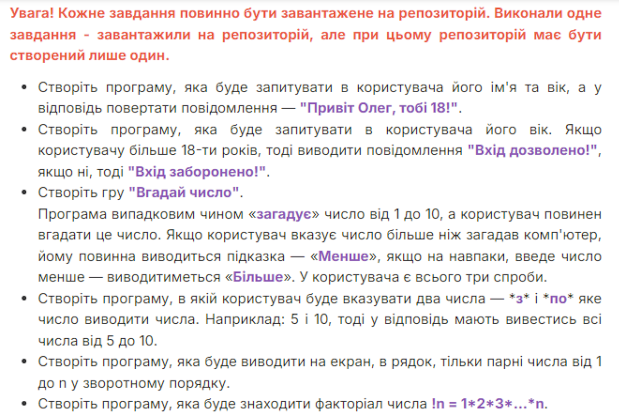

База Python

Об’єктно-орієнтоване та функціональне програмування Python
Зробити всі задачі на фото Згадати базовий синтаксис та логіку Готове дз завантажити на репозиторію, у дз посилання на репозиторію з файлом цих завдянь

